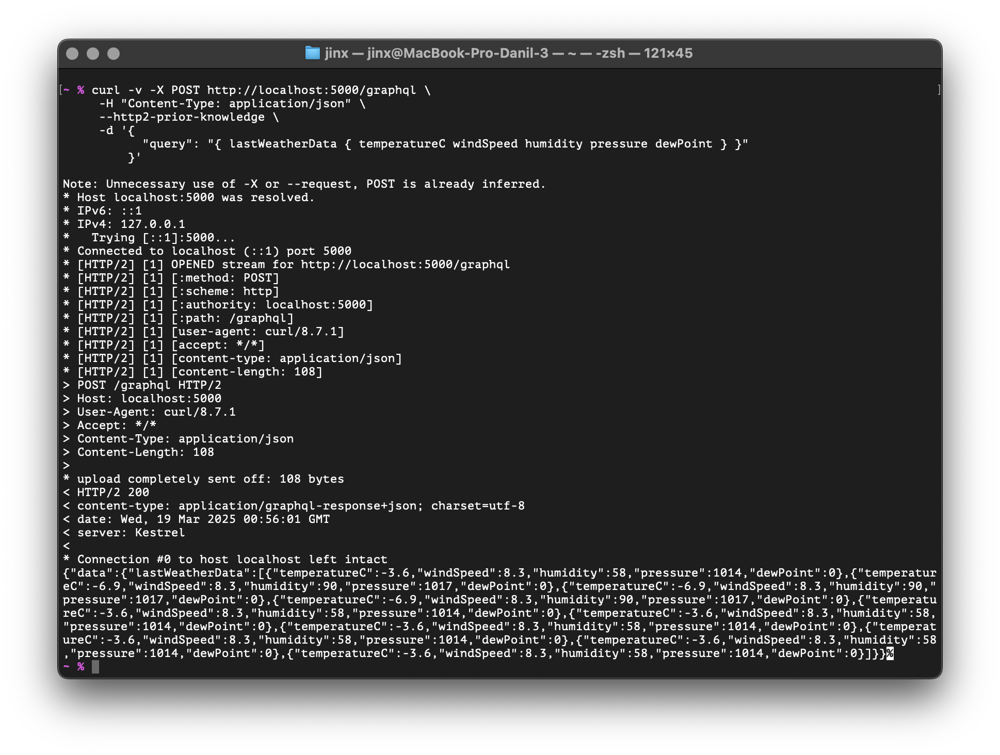

## Тестовое задание


Реализовать следующую конструкцию:
1) Service A - забирает из любого открытого источнинка текущую погоду в г.Казани раз в минуту;
2) Service А делает produce погоды из предыдущего пункта в kafka в topic weather;
3) Service C - реализует метод SetWeater по протолку GRPC (установить погоду);
4) Service B - consume-ит(забирает данные) из топика weather данные о погоде и отправляет в Service C (SetWeather);
5) Service C отдает по GraphQL последние 10 значений погоды и времени получение погоды(последние 10 значений - реализовать через запрос GraphQL);


## GraphQL

HTTP/2 запрос для GraphQL  

```bash
curl -v -X POST http://localhost:5000/graphql \
     -H "Content-Type: application/json" \
     --http2-prior-knowledge \
     -d '{
           "query": "{ lastWeatherData { temperatureC windSpeed humidity pressure dewPoint } }"
         }'
```

